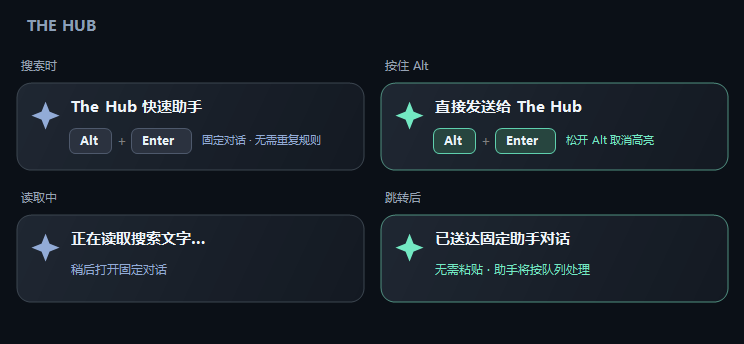

# The Hub

A lightweight native Windows desktop hub for quick actions and AI assistants.

一个轻量的 Windows 原生桌面入口。按 Windows 键搜索 **Hub** 打开窗口；Windows 搜索中的 **Alt+Enter** 将查询带到固定助手对话。



## 当前功能

- 原生桌面窗口和托盘，单实例运行；关闭窗口后继续后台运行。
- 当前用户登录自启动；开始菜单中的 `Hub` 入口。
- Windows 搜索 Alt+Enter：通过本机 Codex 的 `queue` 命令直接发送到固定对话，并打开对话，无需粘贴和回车。
- 提示贴在搜索面板上沿向上展开；按住 Alt 高亮，读取和发送时显示状态。上方空间不足时隐藏，不移到可能被手机联动面板挡住的右侧。
- 固定对话编号可在连接设置修改；规则保留在该对话专用目录，避免每次携带长提示词。
- 读取失败时使用备用输入框；托盘可暂停快捷键或退出。

系统决定开始菜单搜索排序。准确命名为 Hub 有助于匹配，但不能保证高于其他同名应用。提示是独立原生覆盖层，不是对系统搜索栏内部控件的修改。

## 构建与运行

需要 Windows 11 x64、自带 .NET Framework 4.8 或更高版本、Windows PowerShell。自动发送需要已登录、支持 `queue` 子命令的 Codex 桌面配套 CLI。无 Node、Python、WebView 或 NuGet 依赖。

```powershell
./build.ps1
./test.ps1
./install.ps1
```

安装请从开始菜单打开普通 Windows PowerShell 后运行。打包应用内的终端可能重定向 AppData 和开始菜单文件，安装器会检测并拒绝这种环境，避免产生只能被宿主应用看见的安装。

安装到 `%LOCALAPPDATA%\TheHub`。打开 Hub 后在“连接设置”填写固定对话的 `codex://threads/<UUID>` 链接。程序本身不创建对话、不登录账号，也不调用付费模型 API。

自动配置已有对话：

```powershell
./install.ps1 -ThreadId '<conversation UUID>' -RulesPath '<absolute path to assistant AGENTS.md>'
```

RulesPath 可选。先在独立助手对话中发送一次 `docs/assistant-rules-example.txt` 中的规则，并让该对话保存到自己的 AGENTS.md。该文件是专用任务规则，不是账户级全局记忆。

更新时重新运行安装脚本，现有连接配置保留。停止并移除登录自启动和开始菜单入口：

```powershell
./install.ps1 -Uninstall
```

卸载脚本保留本地配置和程序文件，便于恢复；退出托盘程序只影响当前会话。

## 隐私与限制

默认发送不使用剪贴板。只有主动选择备用“复制转入”时才替换剪贴板文本。The Hub 不记录查询内容、不持续读取搜索文字、不把查询当作 shell 命令执行。查询通过本地 Codex 队列发送，并由用户已登录的助手处理；助手的模型调用、工具与联网受该对话配置约束。

命令通过独立参数传递 Unicode 查询，不经 shell。发送在后台执行，超时或无确认时不自动重试，保留查询供用户检查后处理，避免重复发送。CLI 更新可能改变队列接口；找不到 CLI 时可在安装目录的 `codex-path.txt` 指定本机 codex.exe 路径。

搜索窗口随 Windows 更新可能改变。真实搜索、快捷键、深链、混合 DPI 多屏及注销后自启动需要本机验证；基础自测不代替完整桌面验证。已在开发机验证队列直接发送，固定助手收到并回复了测试消息。

## 扩展与开发

当前实现是原生 C# / WinForms 主程序。后续面向用户快捷操作、AI agent 调度和系统定制扩展，详见 [架构与语言选择](docs/architecture.md)。这些扩展类别是规划方向，当前尚无第三方插件安装器或 MCP 服务。

提供一个最小的本地调度入口：`Hub.exe --send "查询文字"`。它发送到已配置的固定对话，返回退出码 0 表示队列已确认；非零时应先检查对话，不要盲目重试。用进程参数调用，不要把未经处理的用户文本拼进 shell 命令。

`src/` 为源码，`build.ps1` 构建，`test.ps1` 运行自测并生成可视预览。私有对话编号、本机路径、日志和构建产物不进 Git。GitHub Actions 构建 Windows 程序并保留测试产物。

## License

MIT.
